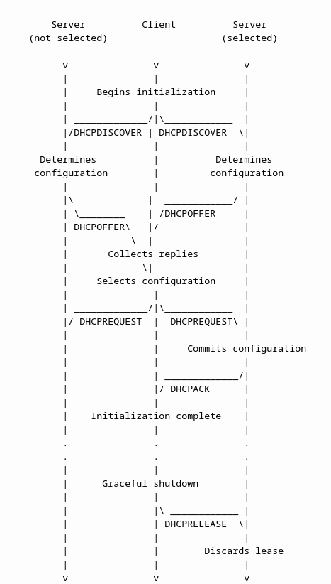
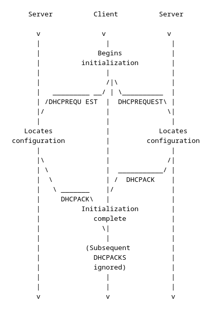
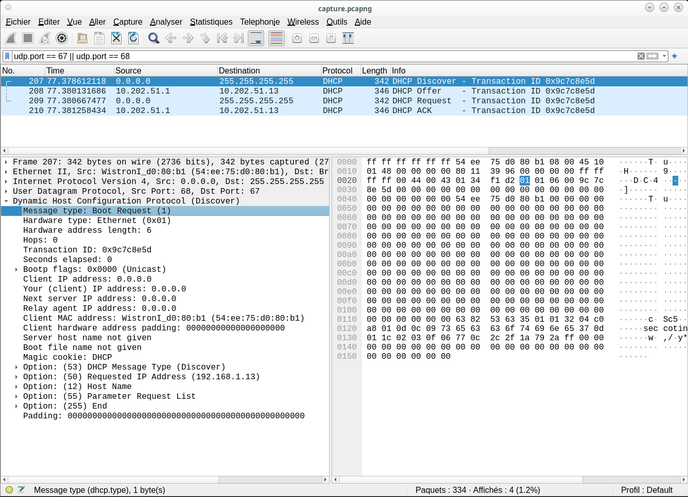
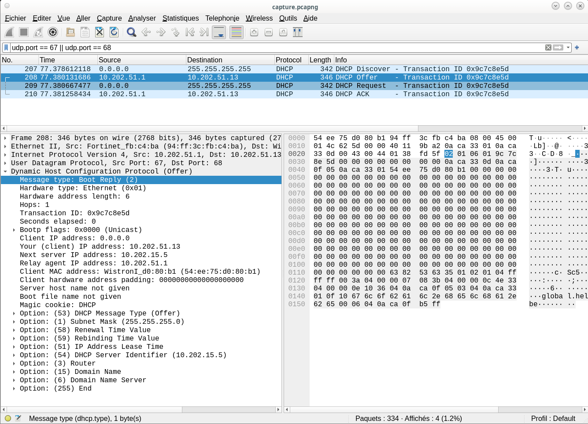
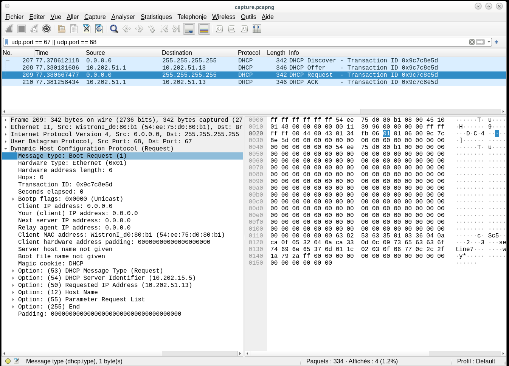
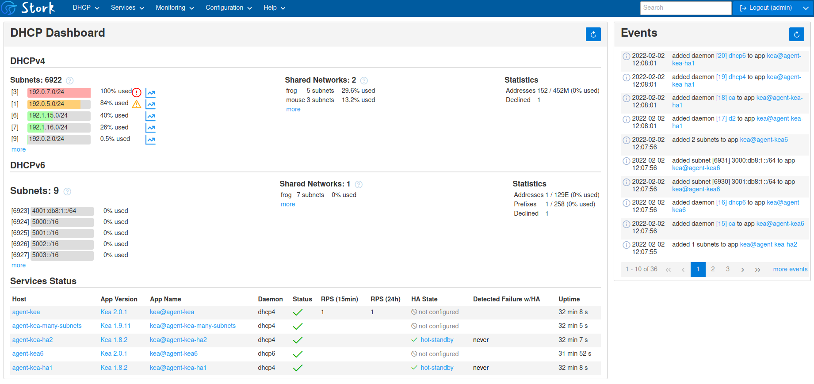

# DHCP


<!-- 
_class: highlight
_footer: ''
_paginate: false
-->


# Atelier de recherche

**Que fait cette commande `dhclient -v`** 
**Expliquer.**

<!--
_class: inverted-orange
-->

# DHCP - Exemple d'exécution

```bash
root@harmony:~# dhclient -v
Internet Systems Consortium DHCP Client 4.4.3-P1
Copyright 2004-2022 Internet Systems Consortium.
All rights reserved.
For info, please visit https://www.isc.org/software/dhcp/

Listening on LPF/enp1s0/52:54:00:68:79:20
Sending on   LPF/enp1s0/52:54:00:68:79:20
Sending on   Socket/fallback
DHCPDISCOVER on enp1s0 to 255.255.255.255 port 67 interval 4
DHCPOFFER of 10.1.0.23 from 10.0.0.1
DHCPREQUEST for 10.1.0.23 on enp1s0 to 255.255.255.255 port 67
DHCPACK of 10.1.0.23 from 10.0.0.1
bound to 10.1.0.23 -- renewal in 41659 seconds.
```

# DHCP - Définition

**DHCP** (_Dynamic Host Configuration Protocol_)

- Mécanisme d'allocation d'adresse IP
- Livraison de paramètres de configuration

**Protocole UDP**
- Port 67 (client → serveur)
- Port 68 (serveur → client)

<br/>

Références : [RFC 2131](https://www.rfc-editor.org/rfc/rfc2131), [RFC 3203](https://www.rfc-editor.org/rfc/rfc3203)

# DHCP - Mécanismes d'allocation

**3 mécanismes :**

- allocation automatique**
  - IP dans le _pool_ permanente
  
- allocation **dynamique**
  - IP dans le *pool* pour une certaine durée
  
- allocation **manuelle**
  - IP fixe

<!-- class: tip -->
> Une IP est attribuée pour une certaine durée : un bail (*lease*)
> 

# DHCP - Avantages et Inconvénients

**Avantages**
- Configuration fiable
- Empêche / évite les conflits d'IP
- Configuration centralisée
  - Si la passerelle change, la configuration se *propagera*
- Facilité de gestion des périphériques itinérants

**Inconvénient**
- Se fait par *broadcast*

# Fonctionnement

<!-- 
_class: inverted
-->

# DHCP - Processus d'attribution

<style scoped>
.columns {
  display: grid;
  grid-template-columns: 30% 70%;
  gap: 1rem;
}
</style>
<div class="columns">
<div>



</div>
<div>

- `DHCP DISCOVER`
    - recherche d'un serveur (_broadcast_)
- `DHCP OFFER`
    - les serveurs répondent en proposant une IP (+ options éventuelles ; masque, passerelle…)
- `DHCP REQUEST`
    - après avoir choisi, le client envoie son paquet (à **tous** les serveurs)
- `DHCP ACK`
    - le serveur envoie un `ACK` (ou un `NACK`) pour valider la demande

</div></div>


# Quels sont les autres *DHCP messages* ?

(Voir RFC)

<!--
_class: inverted 
-->

# DHCP - Renouvellement de bail

<style scoped>
.columns {
  display: grid;
  grid-template-columns: 30% 70%;
  gap: 1rem;
}
</style>
<div class="columns">
<div>



</div>
<div>

Pour la réattribution d'une adresse (en fin de *lease* par exemple), le client envoie directement un paquet `DHCPREQUEST`

<br/>

<!-- class: tip -->
> **Remarque :** Si l'IP est encore utilisée, la demande est envoyée en *unicast* (et pas *broadcast*)

</div></div>


# BOOTP Relay Agent

_Un serveur DHCP ne peut servir qu'un seul segment IP_

- Les requêtes DHCP utilisent le broadcast UDP
- Un agent intermédiaire peut relayer les requêtes DHCP (_broadcast_ vers _unicast_)
<br/>

<!-- class: note -->
> Le Relay Agent ajoute son adresse IP dans le champ `giaddr` (Gateway IP Address)


# BOOTP vs BOOTP Relay Agent

<!-- class: warning -->
> Ne pas confondre BOOTP et BOOTP relay agent
<br/>

<br/>
<div class="columns">
<div>

**BOOTP (Bootstrap Protocol)**
- Protocole original pour l'attribution d'adresses IP (ancêtre, _legacy_)
- Allocation statique uniquement (pas de pool dynamique)
- [RFC 951](www.rfc-editor.org/rfc/rfc951.html)

</div><div>

**BOOTP Relay Agent**
- Mécanisme de relais pour BOOTP et DHCP
- Permet de traverser les routeurs
- [RFC 1542](www.rfc-editor.org/rfc/rfc1542.html)


</div></div>

# Configuration

**Routeur Cisco**

```cisco
ip helper-address 10.0.0.10
```

<!-- class: tip -->
> `ip helper-address` redirige automatiquement les broadcasts DHCP, TFTP, DNS, etc.

<br/>
<br/>

**Linux**
Le paquet `isc-dhcp-relay` (`dhcrelay`) ou le paquet `dhcp-helper`. 


# Atelier de recherche

**Capturer les trames DHCP via Wireshark et déduire le format des trames.**

<br/>
<br/>
<br/>

Le filtre « qui va bien » :
```
udp.port == 67 || udp.port == 68
```
<!-- 
_class: inverted-orange
-->

---


<!--
_header: ''
_footer: ''
_paginate: false 
-->

---


<!--
_header: ''
_footer: ''
_paginate: false 
-->

---


<!--
_header: ''
_footer: ''
_paginate: false 
-->

---


<!--
_header: ''
_footer: ''
_paginate: false 
-->


# isc-dhcp-server
<br/>
<br/>
<br/>

Depuis 2022, l'ISC (_Internet Software Consortium_) recommande **Kea DHCP** (voir plus loin) au lieu de **ISC DHCP**.

<!--
_class: inverted
-->

---
## isc-dhcp-server

`isc-dhcp-server` est un serveur DHCP proposé par l'ISC.

- installation
    ```bash
    apt install isc-dhcp-server
    ```

- configuration

<small><small><small>

```bash
> tree /etc/dhcp
.
├── …
├── debug
├── dhclient.conf
├── dhclient-enter-hooks.d
│   └── …
├── dhclient-exit-hooks.d
│   └── …
├── dhcpd6.conf
└── dhcpd.conf
```

</small></small></small>

---
## isc-dhcp-server 

- préciser dans `/etc/default/isc-dhcp-server` les interfaces sur lesquelles le serveur écoute.

- quelques éléments de configuration (extrait de `dhcpd.conf`)

    ```bash
    option domain-name "example.org";
    option domain-name-servers ns.example.org;
    default-lease-time 86400;
    max-lease-time 604800;
    ```

---
## isc-dhcp-server 

**Attribution automatique d'une adresse dans un certain range**

```conf
subnet 10.0.0.0 netmask 255.0.0.0 {                                               
  range 10.1.0.0 10.1.0.255;  
  option domain-name-servers ns.example.org;
  option domain-name "example.org";
  option subnet-mask 255.0.0.0;                                                   
  option broadcast-address 10.255.255.255;                                        
  option routers 10.0.0.1;                                                        
}  
```

---
## isc-dhcp-server 

**Attribution d'une adresse en fonction de l'adresse MAC** (et envoi du nom de la machine)

```conf
subnet 192.168.192.0 netmask 255.255.192.0 {                                     
    option routers 192.168.192.1;
    option domain-name "example.org";
    option domain-name-servers 192.168.210.1; 
}

host harmony {   
    option host-name harmony;
    hardware ethernet 00:1b:21:[cut];
    fixed-address 192.168.210.2; 
}
```

# DHCP et DNS
**Mise à jour du DNS après attribution d'une IP**
<!--
_class: inverted
-->

---
## DHCP et DNS
<!-- class: info -->
> installation de DDNS (**_dynamic DNS_**) pour la mise à jour automatique de la zone DNS lors de l'octroi d'un *lease* par le server DHCP.

**Rapide procédure :**

1. Création d'une clé pour la communication entre DNS et DHCP et copie dans les répertoires `/etc/bind9` et `/etc/dhcp` pour *bind* et *dhcp*

    ```bash
    dnssec-keygen -a RSASHA512 -b 2048 DDNS_UPDATE
    ```


---
2. Copie de la clé dans un fichier `ddns.key` et copie du fichier aux *endroits qui vont bien*

    ```sh
    > vim ddns.key

    key DDNS_UPDATE {
        algorithm RSASHA512.SIG-ALG.REG.INT;
        secret "r9Fx--cut--tuw==";
    };

    > install -o root -g bind -m 0640 ddns.key /etc/bind/ddns.key
    > install -o root -g root -m 0640 ddns.key /etc/dhcp/ddns.key
    ```

---
3. Configuration de bind9, ajout de la zone

    ```sh
    > vim /etc/bind/named.conf.local

    include "/etc/bind/ddns.key";

    zone "example.org" {
        type master;
        notify no;
        file "/var/cache/bind/db.example.org";
        allow-update { key DDNS_UPDATE; };
    };

    zone "10.in-addr.arpa" {
        // idem
    };
    ```

---
4. Configuration de bind9, création du fichier de zone

    ```sh
    # vim /etc/bind/db.example.org

    ; Zone file 
    ;
    $TTL	86400
    @	IN	SOA	example.org. root.example.org. (
        1970010100 7d 2h 42d 3h);

    @	IN	NS	ns.example.org.
    pica	IN	A	10.0.0.1
    ns		IN	CNAME	pica 

    ; "below" update via dhcp
    ```

    *idem* pour la zone *reverse* *db.10*

---
5. mise à jour de `dhcpd.conf` pour que DHCP fasse les *updates* auprès du DNS

    ```sh
    > vim /etc/dhcpd.conf

    ddns-updates on;
    ddns-update-style interim;
    ignore client-updates;

    include "/etc/dhcp/ddns.key";

    zone example.org. {
        primary 127.0.0.1;
        key DDNS_UPDATE;
    }

    zone 10.in-addr.arpa. {
        // idem
    }
    ```

# Kea DHCP
<br/>
<br/>

successeur de `isc-dhcp-server`
<!--
_class: inverted
-->

---
## Kea DHCP

Quelles sont les différences avec _ISC DHCP_ ?

- modularité : Kea est séparé en 3 daemons ; **DHCPv4 server**, **DHCPv6 server** et **dynamic DNS (DDNS)** module (avec les paquets correspondants `kea-dhcp4-server`, `kea-dhcp6-server` et `kea-dhcp-ddns-server`) auxquels peuvent s'ajouter d'autres modules (par ex. pour la HA (_high availability_));

- configuration _via_ un fichier **JSON** et API REST pour la reconfiguration _à chaud_;

- Kea permet l'utilisation d'un **_backend_** (MySQL, PostgreSQL) pour stocker les données du réseau (_leases_, définition de réservations des hôtes…)
    - un _backend_ partagé par plusieurs instances de Kea

---

- **Stork**, _dashboard graphique_ (peut monitorer plusieurs serveurs)

    

---
- implémentation moderne (_pub inside_)
    - multi-threads
    - performant à grande échelle (beaucoup de machines, _leases_ courts)

---
## Kea DHCP - Configuration 

JSON est utilisé pour la **configuration** et pour l'**API**.  

```json
{
    "Dhcp4": {
        "interfaces-config": {
            "interfaces": [ "eth0" ],
            "dhcp-socket-type": "raw"
        },
        "valid-lifetime": 4000,
        "renew-timer": 1000,
        "rebind-timer": 2000,
    }
}
```


---
Spécifier _lease database_ (ici un fichier plat)

```json
{
    "Dhcp4": {
        # [cut]

        "lease-database": {
            "type": "memfile",
            "persist": true,
            "name": "/var/lib/kea/dhcp4.leases"
        },

    }
}
```

---
Définir le _pool_

```json
{
    "Dhcp4": {
        # [cut]

        "subnet4": [{
            "subnet": "10.1.0.0/8",
            "pools": [ { "pool": "10.1.0.0-10.1.255.255"} ],
            "id": 1
        }]
    }
}
```

---
Faire de la réservations d'hôte

```json
{
    "Dhcp4": {
        # [cut]
        "subnet4": [{
            "subnet": "10.1.0.0/8",
            "pools": [ { "pool": "10.1.0.0-10.1.255.255"} ],
            "id": 1,
            "reservations": [{
                "hw-address": "1a:1b:1c:1d:1e:1f",
                "ip-address": "10.0.0.2",
                "hostname": "harmony"
            },{
                # other host
            }]
        }]
    }
}
```

---
Dans la configuration, possibilité de configurer les _loggers_

```json
{
    "Dhcp4": {
        # [cut]

        "loggers": [{
            "name": "*",
            "severity": "DEBUG"
        }]
    }
}
```

---
Le serveur DHCP peut envoyer des options comme des serveurs DNS

```json
{
    "Dhcp4": {
        # [cut]

        "option-data": [{
            "name": "domain-name-servers",
            "data": "10.0.0.1, 8.8.8.8"
        }]
    }
}
```

---
Les paramètres sont semblables pour le serveur DHCPv6 qui a une section propre

```json
{
    "Dhcp6": {
        # idem

        "subnet6": [
            # …
        ]
    }
}
```

ainsi que le serveur DDNS

```json
{
    "DhcpDdns": {
        # …
    }
}
```


---
Slides dans le cadre de mes cours.
<span class="square"></span>

### Qui suis-je ? 
Pierre Bettens (_pbt_)  
[blog.namok.be](https://blog.namok.be)
pbettens@he2b.be · bettensp@helha.be

### Crédits
GNU linux, _markdown_, Codium, Marpit

Licence WTFL

<style scoped>
    section {text-align: center;}
    .square {
        margin: 15px auto;
        display: block;
        width: 150px;
        height: 150px;
        cursor: pointer;
        background-color: peru;
    }
</style>