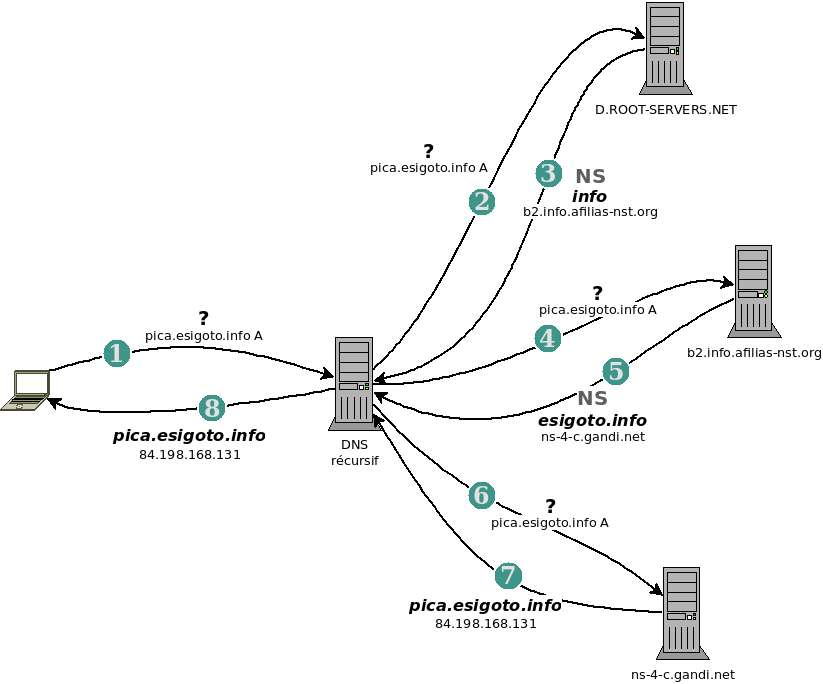
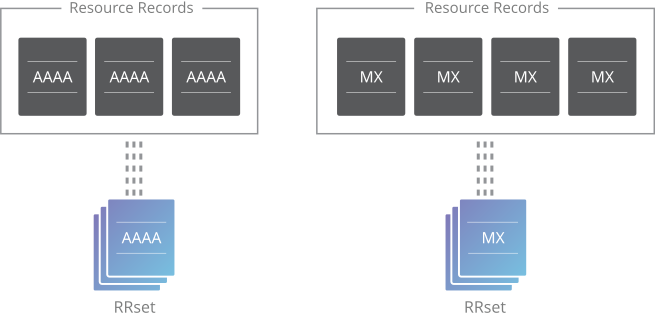
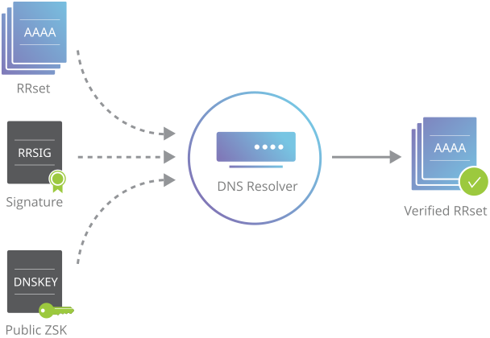

# DNS
## _domain name system_

<!--
_class: inverted
-->

# DNS

Les adresses IP n'étant pas très conviviales, nous retenons les noms de machines… 
<br/>
… un server de noms permet la **correspondance** nom / IP. 


# La résolution des noms

Quels noms ? 

Noms locaux  
`localhost.localdomain` - `l001p01.intranet.example.org` - …

Noms internet   
`pica.esigoto.info` - `monserver.example.org` - …


# La résolution des noms

La résolution de noms peut se faire de différentes manières  
(cfr. `/etc/nsswitch.conf`)

- Table d'hôtes : `/etc/hosts`
- Multicast DNS `mdns`
- Serveur DNS

# La résolution de noms

**mDNS** permet la résolution de noms d’hôtes sur un réseau local sans serveur DNS central.

- chaque appareil envoie des requêtes DNS à l’adresse _multicast IPv4_ `224.0.0.251` (port `5353`)
- les autres appareils du réseau répondent s’ils connaissent le nom demandé.
- ces _mDNS_ se terminent généralement par `.local`
- services associés (chez les autres) : `Bonjour` (Apple) ou `Avahi` (Linux)

# La résolution de noms

<!-- class: tip -->
> ### Histoire
> NIS et NIS+
> NIS (_Network Information Service_) et NIS+ étaient des systèmes centralisés utilisés (*NIX) pour la gestion des informations réseau : utilisateurs, groupes, et aussi la résolution de noms d’hôtes.
> - partage de `/etc/passwd`, `/etc/hosts` sur plusieurs machines;
>
> Remplacés par LDAP, DNS, SAMBA et/ou Active Directory.

# Explosion des noms de domaines de premier niveau
genèse, 2000, 2014


<!--
_class: inverted
_paginate: false
_footer: ''
_header: ''
-->
<style scoped>
    {
        background: black;
    }
    h1 {
        width: 80%;
        margin: auto;
        text-align: center;    
    }
    p {
        text-align: right;
    }
</style>


# Noms de domaine

- Genèse
    `com`, `edu`, `gov`, `mil`, `net`, `int`, `org` et _géographiques_ 

- 2000
    `aero`, `biz`, `coop`, `museum`, `pro`, `info`, `name`

- 2014
    <https://www.iana.org/domains/root/db>

    <small><small><small><small>

    ba baby baidu banamex bananarepublic band bank bar barcelona barclaycard barclays barefoot bargains baseball basketball bauhaus bayern bb bbc bbt bbva bcg bcn bd be beats beauty beer bentley berlin best bestbuy bet bf bg bh bharti bi bible bid bike bing bingo bio biz bj black blackfriday blockbuster blog bloomberg blue bm bms bmw bn bnpparibas bo boats boehringer bofa bom bond boo book booking bosch bostik boston bot boutique box br bradesco bridgestone broadway broker brother brussels bs bt build builders business buy buzz bv bw by bz bzh 

    </small></small></small></small>


# DNS - Fonctionnement

DNS est _acentralisé_ ¹

- permet la gestion du nombre
- dissémine / répartit l'information
- résilient

<br/>

<!-- class: warning -->
> ### Important
> Sans DNS, Internet _est cassé_

<br/>

¹ _a_ privatif. Sans centre. Comme Internet


# DNS - Fonctionnement

Fonctionnement _top / down_ avec _cache_…

- Si le serveur a la réponse en cache ou d'autorité, il répond;
- sinon, il _fait une requête récursive_  auprès des différents serveurs ayant autorité. 

<br/>

<!-- class: warning -->
> ### Remarque
> Le propriétaire (en fait locataire) de la zone (par ex. `example.org`) maintient son fichier de zone (voir plus loin) et « son serveur » DNS a autorité pour cette zone. 


----



<!--
_footer: ''
_paginate: false
-->

# DNS - Fonctionnement

Quelques tests 

```bash
dig esigoto.info
dig esigoto.info +trace

dig . NS @a.root-servers.net
```


**Q ?** Faire de même avec l'option `+nord` (_no recursion desired_).  
**Q ?** Que signifient les _flags_ retournés par `dig` ? 

<br/>

<!-- class: tip -->
>Pour localiser une IP,  
`curl https://ipapi.co/<IP>/yaml -s`


# DNS Logiciels

Le client (_stub resolver_) est le programme qui va faire la requête auprès d'un serveur complet :

- configuré dans `/etc/resolv.conf`
- navigateur internet, `dig`… 

# DNS Logiciels

Le résolveur complet (_full resolver_) est le programme qui peut faire la requête récursive :

- `bind` 
- `unbound` 
- …

Le serveur ayant autorité (_authoritative server_) 

- `bind` 
- …


# Fichiers de zone


<!--
_class: inverted
_paginate: false
_footer: ''
-->

# DNS - Fichiers de zone

Une zone est composée de différents types de champs : 

<br/><center><big>

`SOA`, `NS`, `A`, `AAAA`, `PTR`, `MX`, `CNAME`, `TXT`…

</big></center>

# DNS - Fichiers de zone

Exemple de la zone locale 


```dns
;
; BIND data file for local loopback interface
;
$TTL	604800
@	IN	SOA	localhost. root.localhost. (
			      2		; Serial
			 604800		; Refresh
			  86400		; Retry
			2419200		; Expire
			 604800 )	; Negative Cache TTL
;
@	IN	NS	localhost.
@	IN	A	127.0.0.1
@	IN	AAAA	::1
```

# DNS - Fichiers de zone

Enregistrement `SOA`

- serveur maitre principal de la zone
- adresse email du responsable de la zone (avec `@` remplacé par `.`)
- numéro de série. Convention : `YYYYMMDDVV`
- _Refresh_ temps après lequel un serveur secondaire vérifie si une mise à jour est nécessaire. 
- _Retry_ temps après lequel, un serveur secondaire réessaie s'il n'avait pas eu de réponse. _Retry < Refresh_
- _Expire_ temps après lequel, il abandonne. _Expire > Refresh + Retry_
- _TTL_ durée de validité d'une réponse négative (cfr. [RFC2308](https://datatracker.ietf.org/doc/html/rfc2308))
    

# DNS - Fichiers de zone

Recommandation pour les petits zones stables 
**24h 2h 6w 3h**


# DNS - Fichiers de zone

Exemple d'une zone pour example.org

```conf
;
; BIND data file for example.org zone
;
$TTL    24h
@   IN  SOA example.org. root.example.org. (
    2017010101 24h 2h 42d 3h);
@       IN  NS  ns
@       IN  MX  5 mail
@       IN  MX  10 mail.isp.net.
ns      IN  A   93.94.106.205
ns      IN  AAAA 2a00:1140:2:2::8
serveur IN  A 46.105.92.142
serveur IN  AAAA 2001:41d0:401:3100::4ffe
mail    IN  CNAME serveur
```


# dns menteur 


<!--
_paginate: false
_footer: ''
-->


# DNS - RPZ response policy zone

DNS menteur ou _response policy zone_ (**RPZ**). 

<br/>

Depuis la version `9.8.0` de `bind9`, un DNS peut mentir. 

Dans la conf., préciser dans les options, quelle zone correspond à _response_policy_ et définir la zone ou la récupérer de _quelque part_ (entreprise, état…)

```bind
options {
    // ...
    response-policy { zone "liar.local";};
};
```

<small><small>

Lien [bortzmeyer.org](https://www.bortzmeyer.org/rpz-faire-mentir-resolveur-dns.html)  
Lien [blog.namok.be](https://blog.namok.be/?post/2017/03/05/mise-en-place-dns-menteur)

</small></small>


# DNSEC

<!--
_class: inverted
_footer: ''
_paginate: false
-->


# DNSSEC

DNSSEC est une extension de sécurité à DNS. 

Ajout de signatures crypotgraphiques pour les enregistrements. Les données d'une zone sont signées afin de pouvoir être vérifiées. 

# DNSSEC

DNSSEC ajoute à DNS :

- l'**authentification** de l'origine des données;

    _Les données proviennent bien du serveur supposé être la source._ 

- l'**intégrité** des données;

    _Les données n'ont pas été altérées en chemin. Elles ont été signées par le propriétaire de la zone et je peux le vérifier._

- un **chainage de confiance** (voir plus loin)

# DNSSEC

**Clé de signature de zone** **`ZSK`**

Chaque **zone** DNS a une paire de clés publique-privée.

Cette clé (`ZSK`) est utilisée pour signer les données de la zone. La partie publique de la clé se trouve dans l'enregistrement `DNSKEY`


```bash
dig <name> DNSKEY +multi
```

```bash 
;; ANSWER SECTION:
example.org.    3564 IN DNSKEY 256 3 13 (
                    hN+W90ybHRZT2qZM[cut]ZoOq8WHONiOeVQtn
                    LJPszWFr1UYUzuSV[cut]EaZf702W2GzdmcQ==
                ) ; ZSK; alg = ECDSAP256SHA256 ; key id = 64700
```

# DNSSEC

DNSSEC ajoute les champs suivants :

<big><big><center>

`DNSKEY`, `RRSIG`, `DS`, `NSEC`, `NSEC3`, `CDNSKEY`, `CDS`

</center></big></big>

# DNSSEC

- `DNSKEY` la partie publique de la clé
- `RRSIG` contient le signature cryptographique du `RRset` correspondant
- `DS` le _hash_ de la `DNSKEY`
- `NSEC` et `NSEC3` pour le déni d'existence explicite d'un enregistrement
- `CDNSKEY` et `CDS` pour une zone enfant demandant des mises à jour dans la zone parent

<br/>

_(voir la suite)_

# DNSSEC

**RRsets**

Rassemble des enregistrements de même type pour un même _label_ (Par ex. `host.example.org`). C'est cet ensemble qui sera signé.



# DNSSEC

```bash
dig example.org  +dnssec
```

```bash
example.org.    4214 IN A 93.184.216.34
example.org.    4214 IN RRSIG A 13 2 86400 (
                    20231013015700 20230922122122 64700 example.org.
                    6gn68jzj2mdSAfY+4IzcHvlg5geEvasp6+xWSJX7v+MC
                    GFTMmQpp42CoXePyKkxJYi0HHlzhrlHazZ3D0BmQvQ== )
```

<small><small>
<div class="columns">
<div>

- A: le type d'enregistrement
- 13 : l'algorithme utilisé
- 2 : le nombre de labels du RRSet
- 86400 : le TTL originel
- 20231013015700 : la date d'expiration

</div><div>

- 20230922122122 : 
- 64700 : _keytag_ (identifiant non-unique de la clé)
- example.org : nom du signataire 
- … : la signature 
</div></div>
</small></small>

# DNSSEC

Ensemble, _RRset_, _RRSIG_ et la _DNSKEY_ peuvent valider la réponse. 

<br/>



# DNSSEC

**Clé de signature de clé** **`KSK`**

La clé `ZSK` est utilisée pour signer les _RRsets_. 

De même la clé `KSK` (_key signing key_) est utilisée pour signer la `ZSK`. 

# DNSSEC

**Chaine de confiance**

Comment être sûr de l'authenticité de la clé publique (`KSK`) ?

En _hashant_ cette clé et en fournissant le _hash_ à la **zone parent**. Ce _hash_ se trouve dans l'enregistrement `DS`. 

De parent en parent, ceci établit une chaine de confiance. 

\vfill

`.` signe `.org` qui signe `example.org`…


# DNSSEC

```bash
dig ds example.org [+dnssec] +multi
```

<br/>

```bash
example.org.    732 IN DS 22273 13 2 (
                    71405420F[cut]D58737
                    60E24A3B4DC61A964FEE )
```

# DNSSEC

Les enregistrements `NSEC` et `NSEC3` permettent de « signer » les réponses vides précisant qu'une zone n'existe pas. 

<br/>
<br/>

<!-- class: warning -->
> ### Remarque
> `NSEC` est réputé sensible à _zone walking attack_. `NSEC3` moins. 


# DNSSEC

```bash
dig A +dnssec a.dnstests.ovh 
dig A +dnssec sub.dnstests.ovh
```

<br/>

```bash
dnstests.ovh.   12  IN  NSEC sub.dnstests.ovh. 
        A NS SOA RRSIG NSEC DNSKEY

sub.dnstests.ovh.   3600    IN      A       1.2.3.4
sub.dnstests.ovh.   3600    IN      RRSIG   
        A 8 3 3600 20231101075445 
        20231002075445 44275 dnstests.ovh. o+H7SO0/y[cut]PgT gWo=
```

# DNSSEC

```bash
dig A +dnssec public.example.org
```
<br/>

```bash
22cse7p1cuuea0185da5kpjrmajk5gpr.example.org. 3535 IN 
        NSEC3 1 0 5 
        B014[cut]BU A NS SOA MX TXT AAAA RRSIG DNSKEY NSEC3PARAM
```


# bind9
<!--
_class: inverted
_header: ''
_footer: ''
_paginate: false
-->

# bind

Mise en place de `bind9`

```bash
apt install bind9
```

# bind

Fichiers de configuration : 

<small>

```bash
/etc/bind/
├── bind.keys
├── db.0
├── db.127
├── db.255
├── db.empty
├── db.local
├── db.root
├── named.conf
├── named.conf.default-zones
├── named.conf.dpkg-dist
├── named.conf.local
├── named.conf.options
├── named.conf.options.dpkg-dist
├── rndc.key
└── zones.rfc1918
``` 

</small>


# unbound
<!--
_class: inverted
_paginate: false
_footer: ''
_header: ''
-->

# unbound

Mise en place de `unbound`

```bash
apt install unbound
```

# unbound

Fichiers de configuration : 


```bash
/etc/unbound/
├── unbound.conf
├── unbound.conf.d
    ├── qname-minimisation.conf
    └── root-auto-trust-anchor-file.conf
├── unbound_control.key
├── unbound_control.pem
├── unbound_server.key
└── unbound_server.pem
```

