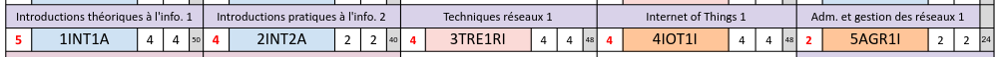
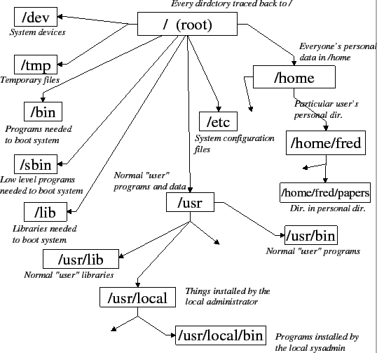

  
  
# Administration et gestion des réseaux I
<br/>

## Rappels linux


<!-- 
_class: highlight
_footer: ''
_paginate: false
-->

---



<!--
_paginate: false
_footer: ''
_header: ''
-->

# Rappels nécessaires au cours


<!--
_footer: ''
_header: ''
_paginate: ''
-->

# Filesystem linux

- hiérarchique, organisé en arborescence à partir de la racine `/`.
- un seul _filesystem_ - plusieurs points de montage
- plusieurs répertoires dédiés : `/etc`, `/bin`…



# Droits d'accès 

- Chaque fichier/répertoire a des droits : **read (r)**, **write (w)**, **execute (x)**
- Droits attribués à : **u** : user (owner), **g** : group, **o** : others
- Commandes : `ls -l`, `chmod`, `chown`, `chgrp`…
- Représentation octale : `chmod 754 fichier`


<br/>

Exemple : `-rwxr-xr--`
    - **u** : rwx (lecture, écriture, exécution)
    - **g** : r-x (lecture, exécution)
    - **o** : r-- (lecture)


# Processus et gestion

- Un **processus** est un programme en cours d'exécution.
- Chaque processus possède un identifiant (**PID**).
- Les processus peuvent être listés, surveillés et arrêtés.

**Commandes utiles :**
- `ps faux` : liste tous les processus.
- `top` (`htop`, `btop`) : affiche les processus en temps réel.
- `kill <PID>` : termine un processus (exemple : `kill 1234`).


# Signaux et commande `kill`

- La commande `kill` envoie un **signal** à un processus identifié par son PID.
- Par défaut, **SIGTERM** (15), qui demande l'arrêt gracieux du processus.
- On peut spécifier un autre signal, par exemple : **SIGKILL** (9) : arrêt forcé et immédiat du processus.

```bash
kill <PID>        # Envoie SIGTERM (15)
kill -9 <PID>     # Envoie SIGKILL (9)
```

<br/>

<!-- class: tip -->
> `SIGTERM` est une _demande de mise à mort_ alors que `SIGKILL` est une exécution sommaire.

# shell

Un **shell** est un programme qui permet d'interagir avec le système d'exploitation via une interface en ligne de commande.

- **Bash** (_Bourne Again SHell_) est l'un des shells les plus utilisés sous Linux.
- Il offre des fonctionnalités avancées : scripts, variables, redirections, etc.
- D'autres shells existent : `sh`, `zsh`, `fish`, etc.

# shell

```bash 
#!/bin/bash
# Documentation 
set -eo pipefail

VAR1="value 1" 
VAR2="value 2"

set -u

usage() {
	echo "Usage…"
	exit 1
}

# do stuff now
```

# shell

- `-e` : arrêt du script en cas d'erreur
- `-o pipefail` : si une commande dans un pipeline échoue, le pipeline entier retourne un code d’erreur. Sans cette option, seul le code de sortie de la dernière commande du pipeline est pris en compte.
- `-u` : arrêt si une variable non initialisée est utilisée
<br/>
<!-- class: note -->
> ### Remarque
> Il y a toujours un moment où il faut écrire un _p'tit script_.


# Gestion des _users_

Chaque utilisateur possède un identifiant (**UID** _user id_) et appartient à un ou plusieurs groupes (**GID** _group id_).

**Fichiers importants :**
- `/etc/passwd` : informations de base sur les utilisateurs.
- `/etc/group` : liste des groupes et leurs membres.
- `/etc/shadow` : mots de passe chiffrés.

<!-- class: tip-->
> ### Configuration du chiffrement
> Défini par **PAM** dans `/etc/pam.d/common-password` (et dans `/etc/login.defs`)

# Gestion des _users_

Commande utiles
- `adduser` / `useradd` : création d'un nouvel utilisateur.
- `usermod` : modification des paramètres d'un utilisateur.
- `groups <utilisateur>` : affiche les groupes d'un utilisateur.
- `chage` : gestion de la durée de vie du mot de passe.

```bash
adduser alice
usermod -aG sudo alice
groups alice
chage -l alice
```

# Gestion des _users_

<!-- class: important -->
> **Fichiers squelettes**
> Lors de la création d'un utilisateur, les fichiers du répertoire `/etc/skel` sont copiés dans son dossier personnel.
> _Ces fichiers servent de modèle pour l'environnement initial de l'utilisateur._

# Gestion des _users_

`usermod -L <user>` : désactivation / verrouillage (_lock_) du compte 

`userdel <user>` : suppression (_delete_) de l'utilisateur 
`deluser <user>` : suppression de l'utilisateur
- `--remove-home` supprime également le dossier personnel (`HOME`)
- `--remove-all-files` (plus fort) supprime tous les fichies du _user_

<br />

```bash
usermod -L alice                    # Désactive le compte
deluser --remove-all-files alice    # Supprime le compte et les fichiers du user
```

# Boot du système

Le **boot** est le processus de démarrage d'un ordinateur, depuis la mise sous tension jusqu'au lancement du système d'exploitation.

- Initialisation matérielle
- Recherche d'un périphérique de démarrage
- Chargement du programme d'amorçage (_bootloader_)
- Chargement du noyau Linux

# BIOS vs UEFI

- **BIOS** (_Basic Input/Output System_) : ancien système d'amorçage, interface simple, limitations (disques < 2 To, mode 16 bits).
- **UEFI** (_Unified Extensible Firmware Interface_) : moderne, interface graphique, support des disques GPT (> 2 To), plus sécurisé (Secure Boot).

<br/>
<center>

| BIOS | UEFI |
|------|------|
| MBR | GPT |
| < 2 To | > 2 To |
| Ancien | Moderne |

</center>


# Bootloader : LILO vs GRUB(2)

- **LILO** (_LInux LOader_) : ancien, simple, peu flexible, ne supporte pas les systèmes de fichiers modernes.
- **GRUB(2)** (_GRand Unified Bootloader_) : actuel, flexible, support de nombreux OS, interface graphique, édition dynamique.

<br/>
<center>

| LILO | GRUB(2) |
|------|---------|
| Statique | Dynamique |
| Peu d'options | Menu interactif |
| Obsolète | Standard actuel |

</center>


# Chargement du noyau

- **vmlinuz** : image compressée du noyau Linux.
- **initrd.img** : disque RAM initial, contient les modules nécessaires au démarrage (drivers, scripts).

**Processus :**
1. Le bootloader charge `vmlinuz` et `initrd.img` en mémoire.
2. Le noyau s'initialise et monte le système de fichiers racine.
3. L'_init_ démarre les services système.


# SysV init vs systemd

- **SysV init** : historique, scripts dans `/etc/init.d/`, séquentiel, moins rapide.
- **systemd** : moderne, parallélise le démarrage, gestion avancée des services, journalisation intégrée.

<center>

| SysV init | systemd |
|-----------|---------|
| Scripts shell | Unités (unit files) |
| Démarrage séquentiel | Démarrage parallèle |
| Moins flexible | Contrôle avancé |

</center>

<!-- class: tip -->
> **systemd** est aujourd'hui le système d'initialisation par défaut sur la plupart des distributions Linux.

# Shutdown


<!--
class: highlight 
-->

# Shutdown

- `shutdown` : arrêt ou redémarrage planifié du système
- `halt` : arrêt immédiat, sans fermeture propre des services
- `reboot` : redémarrage du système
- `init <i>` : switch dans un autre _runlevel_ (0, shutdown, 6 reboot) 
- `Ctrl+Alt+Del` : redémarrage matériel (souvent configuré via systemd)

```bash
shutdown -h now   # Arrêt immédiat
shutdown -r now   # Redémarrage immédiat
```

<!-- class: warning -->
> Privilégier `shutdown` pour un arrêt propre du système car cette commande arrête proprement les services.

# Sauvegarde (_backup_)

<!-- class: important-->
> L'importance d'une sauvegarde n'apparaît jamais aussi cruciale que le jour de la perte des données.

**Que sauvegarder ?**
- Fichiers critiques, configurations, bases de données, documents utilisateurs…
- Sur quels supports ? Disques externes, serveurs distants, cloud, bandes magnétiques…
- Période d'indisponibilité ? Coût ? Fréquence des sauvegardes ?
- De quels types d'erreurs se protège-t-on ? (Erreur humaine, cause naturelle, défaillance matérielle…)

# Sauvegarde (_backup_)
**Politique de sauvegarde**

- Définir une **politique** claire : quoi, quand, comment et où sauvegarder.
- Prévoir des **scénarios de restauration** pour tester l'efficacité des backups.
- Documenter les procédures et automatiser les sauvegardes.

# Sauvegarde (_backup_)
### Règle du 3–2–1

- **3 copies** des données
- **2 supports** différents (disque dur, cloud, bande…)
- **1 copie** hors site (externe au site principal)

# Sauvegarde (_backup_)
### Outils de sauvegarde

- **rsync** : synchronisation et copie incrémentale de fichiers/dossiers.
- **dump / restore** : sauvegarde/restauration de partitions ou systèmes de fichiers.
- **tar** : archivage et compression de fichiers/dossiers.

---
```bash
# Exemple avec rsync
rsync -av --delete /home/ /backup/home/

# Exemple avec tar
tar czf backup.tar.gz /etc /home

# dump d'une partition ext4
dump -0u -f /backup/sda1.dump /dev/sda1
restore -rf /backup/sda1.dump
```
<br/>

<!-- class: warning -->
> **Tester la restauration !**
> Une sauvegarde non testée n'est pas une sauvegarde fiable.

---
### et le cloud ? 

**« There is no cloud. 
It's just someone else's computer. »**

<!--
_class: inverted
-->
<style scoped>
p {
    text-align: center;
    font-size: 1.5rem;
    margin-top: 3rem;
}  
</style>


---
<br/>
<br/>
<br/>
<br/>
<br/>

Pour automatiser l'exécution de commandes ou scripts à intervalles réguliers, on utilise **cron**.


<!--
_class: highlight 
-->

# cron

**cron** est le service qui exécute les tâches périodiques.

- Les règles sont définies dans des fichiers spécifiques : `/etc/crontab`, `/etc/cron.allow` et `/etc/cron.deny`.
- Chaque _user_ peut éditer **son*** fichier _cron_ via `crontab -e`
<br/>

```cron
# minute heure jour mois jour_semaine commande
0,15,30,45 12-13 * * 1-5 /home/login/allermanger
```

<!-- class: tip -->
> Utilisez `crontab -l` pour lister vos tâches planifiées.


# Gestionnaire de paquets

**APT** (_Advanced Package Tool_) est le gestionnaire de paquets utilisé par Debian et ses dérivés (Ubuntu…).

- Permet d’installer, mettre à jour, supprimer des logiciels.
- Gère les dépendances automatiquement.
- Utilise des dépôts en ligne pour récupérer les paquets.

# Commandes de base avec `apt`

```bash
apt update           # Met à jour la liste des paquets disponibles
apt upgrade          # Met à jour les paquets installés
apt install <pkg>    # Installe un paquet
apt remove <pkg>     # Supprime un paquet
apt search <mot>     # Recherche un paquet
apt show <pkg>       # Affiche les infos d’un paquet
```
<br/>

<!-- class: tip -->
> Utilisez `apt autoremove` pour supprimer les paquets inutiles après une désinstallation.

# Fichiers et dépôts

- Les sources des paquets sont définies dans `/etc/apt/sources.list` et `/etc/apt/sources.list.d/`.
- Les paquets téléchargés sont stockés dans `/var/cache/apt/archives/`.
<br/>

<!-- class: important -->
> **dpkg** est l’outil bas niveau : `dpkg -i paquet.deb` installe un paquet local, mais ne gère pas les dépendances.

---
sudo or not sudo ? 

<!--
_class: inverted
-->
<style scoped>
p {
    text-align: center;
    font-size: 1.5rem;
    margin-top: 3rem;
}  
</style>
