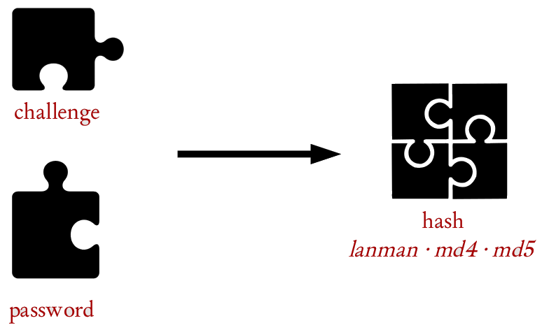

# SAMBA


<!-- 
_class: highlight
_footer: ''
_paginate: false
-->

# SAMBA 

Mise en œuvre du protocole SMB / CIFS de Microsoft pour le partage de fichiers (et d'imprimantes).

<br/>

Samba est une réimplémentation du protocole SMB / CIFS pour *nix ce qui permet une communication MS Windows / *unix.

# NetBIOS

Mode de nommage dans un voisinage réseaux : API _couche 5 (session)_ utilise les ports `137`, `138` et `139`.

- NetBIOS implémenté (sans IP) par NetBEUI (_obsolète_)
- NetBIOS implémenté (sur IP) par NetBT

Un nom NetBIOS fait 15 + 1 caractères (le 16^{ième} pour le rôle)

<br/>
<small><small>

Cfr NetBIOS-suffix
</small></small>

---

<!--
_header: ''
_footer: ''
_paginate: false
-->

# Voisinage réseau

Le **voisinage réseau** (_browse list_) permet de visualiser les machines et leurs partages sur un même segment IP.

---
## Master Browser

<div class="columns30">
<div>
<br/>


</div><div>

Le **master browser** est responsable du maintient de la liste d'exploration (_browse list_)

- élection automatique
- critères d'élection : version OS, type de machine, temps de fonctionnement
- le master browser collecte les annonces `__MSBROWSE__` 

</div></div>

---

| Aspect | Détail |
|:-------|:-------|
| **Fréquence** | Toutes les 12 minutes |
| **Transport** | UDP ports 137 (noms) et 138 (datagrammes) |
| **Mode** | Broadcast sur le segment local |
| **Timeout** | 36 minutes (3 périodes manquées) |
| **Portée** | Segment local uniquement |

<br/>

<!-- class: warning -->
> **Important :** Sans serveur WINS, le voisinage ne fonctionne que sur le segment local (les broadcasts ne traversent pas les routeurs)

# WINS

**WINS** (_Windows Internet Name Service_)

Service de résolution de noms NetBIOS vers adresses IP   
Alternative au broadcast NetBIOS.
<br/>

<!-- class: note -->
> **Tip** 
> WINS est essentiel dans les réseaux routés avec plusieurs segments IP

----
## Configuration Samba comme serveur WINS

Extrait de configuration Samba (_see below_)
```ini
[global]
    wins support = yes
    wins server = 192.168.1.10
    name resolve order = lmhosts wins bcast host
```

# Authentification

Samba supporte plusieurs modes d'authentification pour l'accès à un partage.

<big>

`share` - `user` - `server` - `domain`

</big>

---

### Share-level security (**OBSOLÈTE**)
```ini
[global]
    security = share
```
- Authentification par **partage** (pas par utilisateur)
- Mot de passe demandé pour chaque partage
- **Abandonné depuis Samba 4.0**
- Remplacé par `guest ok = yes` au niveau des partages

---
### User-level security
```ini
[global]
    security = user
    passdb backend = tdbsam
```
- Authentification par **compte utilisateur**
- Base locale des comptes Samba (`/var/lib/samba/private/`)
- Mode par défaut et recommandé pour serveurs autonomes

---
### Server-level security (**OBSOLÈTE**)
```ini
[global]
    security = server
    password server = 192.168.1.100
```
- Délégation vers un **serveur d'authentification**
- **Déprécié depuis Samba 3.x**
- Remplacé par domain security

---
### Domain-level security 
```ini
[global]
    security = domain
    workgroup = MONDOMAINE
    password server = *
```
- Intégration complète dans un **domaine Active Directory**
- Authentification via contrôleur de domaine
- Support Kerberos et NTLM
<br/>

<!-- class: important -->
> **Important** 
> Utiliser `security = user` pour un serveur autonome ou `security = domain` pour l'intégration AD


# Challenge-Response

Protocole sécurisé évitant la transmission du mot de passe en clair sur le réseau.


---
<div class="columns30">
<div>
<br/>



</div><div>

1. **Client** demande l'accès à une ressource
2. **Serveur** envoie un **challenge** (nombre aléatoire)
3. **Client** chiffre le challenge avec son mot de passe haché
4. **Serveur** vérifie la réponse avec sa copie du hash

</div></div>

# NTLM v1 : LAN Manager et NT Hash

Premier protocole d'authentification Microsoft, aujourd'hui **obsolète**.

- LAN Manager
    - Mot de passe → UPPERCASE → Padding 14 chars → Split 7+7
    - Chaque moitié → DES avec clé fixe "KGS!@#$%" 
    - Concaténation des résultats → LM Hash (32 hex)
- NT Hash
    - Mot de passe → Unicode UTF-16LE → MD4 → NT Hash (32 hex)

<br/>

<!-- class: caution -->
> **Attention** 
> Désactiver NTLM v1

# NTLM v2 

Version améliorée d'NTLM avec une sécurité renforcée

- Username + Domain → Unicode → HMAC-MD5(NT Hash) → NTLMv2 Hash
<br/>

Configuration Samba NTLMv2

```ini
[global]
    ntlm auth = ntlmv2-only # default Samba 4.7
```

# Installation Samba

Paquets : `samba samba-common` `smbclient`
<br/>
Daemons associés
- `smbd` SMB/CIFS File Server  
    Partage de fichiers et imprimantes, gestion des connexions SMB/CIFS, authentification, contrôle d'accès.  
    **Port TCP 445** (SMB direct) et **139** (NetBIOS session service)

---
- `nmbd` NetBIOS Name Server
    Service de noms NetBIOS, gestion du voisinage réseau (_browse list_), élection du Master Browser et serveur WINS (optionnel)
    **Port UDP 137** (NetBIOS name service) et **138** (NetBIOS datagram service)

- `winbind` Domain Integration
    Intégration Active Directory, résolution UIDs/GIDs dynamiques, Single Sign-On avec Windows et support des groupes de domaine.

# Configuration Samba

Fichier `/etc/samba/smb.conf`

```ini
# Section globale (obligatoire)
[global]
    # Paramètres généraux du serveur
    
# Sections de partages
[nom_partage]
    # Configuration spécifique au partage
    
[homes]
    # Partage automatique des répertoires utilisateurs
    
[printers]
    # Configuration des imprimantes
```

---
## Section `[global]`

### Paramètres essentiels
```ini
[global]
    workgroup = WORKGROUP
    server string = Serveur Samba %h
    netbios name = MONSERVEUR
    
    # Sécurité
    security = user
    
    # …
```

---
### Variables Samba

Système de substitution automatique pour personnaliser la configuration.

<div class="columns">
<div>

| Variable | Description |
|:---------|:------------|
| `%u` | nom d'utilisateur actuel |
| `%U` | nom d'utilisateur demandé |
| `%g` | groupe primaire de %u |
| `%G` | groupe primaire de %U |
| `%m` | nom NetBIOS du client |
| `%M` | nom DNS du client |
| `%I` | adresse IP du client |

</div><div>

| Variable | Description |
|:---------|:------------|
| `%h` | nom d'hôte du serveur |
| `%L` | nom NetBIOS du serveur |
| `%S` | nom du service actuel |
| `%P` | répertoire racine du service |
| `%T` | heure/date actuelle |

(cfr. `man smb.conf`)

</div></div>

---
```ini
[global]
    # Log par machine cliente
    log file = /var/log/samba/log.%m
    
    # Message de bienvenue personnalisé
    server string = Serveur %h - Connexion de %m (%I)

[homes]
    # Partage utilisateur dynamique
    path = /home/%u
    comment = Répertoire de %U
    
[profiles]
    # Profils utilisateurs
    path = /srv/samba/profiles/%u
    create mask = 0600
```

---
## Validation de la configuration

`testparm` vérifie la validité syntaxique du fichier de configuration.

```bash
testparm
```
<br/>

<!-- class: tip -->
> **Tip :** Utiliser `testparm` avant chaque redémarrage des services pour éviter les erreurs de configuration

# Gestion des utilisateurs Samba

Les utilisateurs Samba sont **distincts** des utilisateurs Unix mais doivent correspondre.


```bash
# Prérequis : l'utilisateur Unix doit exister
adduser john
passwd john
# Puis créer l'utilisateur Samba
sudo smbpasswd -a john
```

# Tests 

`smbclient` est un client en ligne de commande _à tout faire_
<small>

```bash
smbclient -L //localhost -U username
smbclient //serveur/partage -U username

smb: \> ls
smb: \> cd dossier
smb: \> get fichier.txt
smb: \> put fichier.txt
smb: \> exit
```
</small>

`smbstatus` montre voir l'activité
<small>

```bash
smbstatus
```
</small>

---
## Logs en temps réel

Les logs se trouvent dans le répertoire `/var/log/samba/`

```bash
tail -f /var/log/samba/log.smbd
tail -f /var/log/samba/log.192.168.1.50
```
<br/>

## Vérifier les ports

```bash
# Ports Samba ouverts
netstat -tulpn | grep -E '(smbd|nmbd)'
```

---
## Test de résolution de noms

```bash
# Résolution NetBIOS
nmblookup serveur

# Ping NetBIOS
nmblookup -A 192.168.1.10
```


---
Slides dans le cadre de mes cours.
<span class="square"></span>

### Qui suis-je ? 
Pierre Bettens (_pbt_)  
[blog.namok.be](https://blog.namok.be)
pbettens@he2b.be · bettensp@helha.be

### Crédits
GNU linux, _markdown_, Codium, Marpit

Licence WTFL

<style scoped>
    section {text-align: center;}
    .square {
        margin: 15px auto;
        display: block;
        width: 150px;
        height: 150px;
        cursor: pointer;
        background-color: peru;
    }
</style>