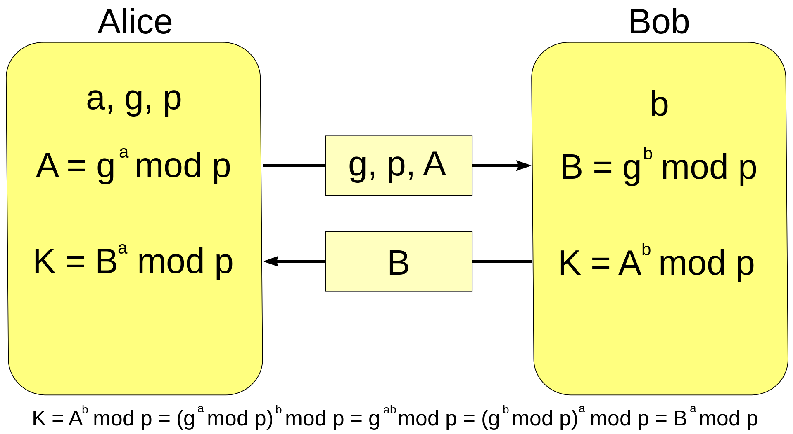
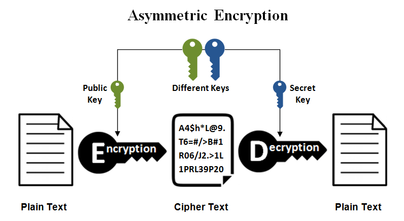

# SSH
<br/>

## Secure shell


<!-- 
_class: highlight
_footer: ''
_paginate: false
-->


# SSH


SSH (_Secure Shell_) est un protocole de communication sécurisé qui permet aux utilisateurs et utilisatrices de se connecter à un serveur distant et d'exécuter des commandes à distance.

# Ateliers de recherche

`ssh -v bob@pica.esigoto.info`

<!--
_class: 'inverted'
-->

# SSH

```bash
ssh [<user>@]<ip | hostname>
```

```bash
ssh alice@harmony.example.org
ssh 10.0.0.5
```

<br/>

- Connexion à une machine distante pour obtenir un `shell`. 
- Son ancêtre: `rsh` _aka_ _remote shell_.

# 1
SSH permet de s'assurer que l'on se connecte au bon serveur…

<!--
_class: 'inverted-orange'
-->

# SSH

Première connexion à une machine : 

```
The authenticity of host 'localhost (::1)' can t be established.
ECDSA key fingerprint is SHA256:yHN0v46EffSqvY6yl[cut].
Are you sure you want to continue connecting 
(yes/no/[fingerprint])? 
```

- Le serveur présente sa clé publique que j'accepte.
- Pour les autres connexions `ssh` prévient si elle change : mise à jour du serveur ou usurpation.

<!-- class: tip -->
> La vérification de l'empreinte est possible avant de l'accepter  
`ssh-keygen -l -f /etc/ssh/ssh_host…` et diffusée sur un autre canal. 

# 2
SSH chiffre la communication…

<!--
_class: 'inverted-orange'
-->


# SSH

Principe : 

**1** le client reçoit la clé publique du serveur

- Algorithme de cryptographie **asymétrique** : `DSA` (obsolète), 
`RSA` (taille minimale 4096), `ed25519`, `ecdsa`… 

    ```bash 
    ssh -Q key
    ```

<br/>
<small>

<!-- class: tip -->
> - La vérification de l'empreinte permet de s'assurer de sa légitimité (voir **1**)
> - Le client peut aussi vérifier que le serveur possède la clé privée en envoyant un message. 

</small>

# SSH

**2** le client et le serveur doivent s'accorder — sur un canal non sûr — pour s'échanger une **clé de session** commune.
    
- Algorithme cryptographique d'échange de clés : _Diffie-Hellman_

    ```bash
    ssh -Q kex
    ```

# SSH

**3** le client peut alors s'authentifier.

**4** ils peuvent communiquer en chiffrant les messages (_confidentialité_) et en les signant (_intégrité_).

- Algorithme de cryptographie **symétrique** : _AES_, _blowfish_, _chacha20_…

    ```bash
    ssh -Q cipher
    ```


# Échange de clés

<!--
_class: 'inverted'
-->


# Cryptographie - Échange de clés - Diffie-Hellman

<div class='columns'>
<div>

Les algorithmes _Diffie-Hellman_ sont une méthode d'échange de clés sur un canal de communication non sûr. 


_Illustration avec des pots de peinture_

</div>
<div>
<center>

_paint.png)

</div></div>


# Cryptographie - Échange de clés - Diffie-Hellman



- **Diffie-Hellman** se base sur l'exponentielle (et est sensible au problème du logarithme discret)

- **Elliptic Curve Diffie-Hellman** `ECDH` se base sur les courbes elliptiques

# Cryptographie - Échange de clés - Diffie-Hellman

**Exemple**

Données communes :
- Nombre premier `P = 419`
- Générateur `G = 7`

**Génération des clés privées :**

<div class='columns'>
<div>

**Alice** « choisit » `a = 178`  
Envoie à Bob :  
`A = 7^178 mod 419 = 208`

</div>
<div>

**Bob** « choisit » `b = 344`  
Envoie à Alice :  
`B = 7^344 mod 419 = 49`

</div>
</div>

---
**Exemple** (suite)

**Calcul de la clé partagée :**

<div class='columns'>
<div>

Alice calcule :  
`K = 49^178 mod 419 = 107`

</div>
<div>

Bob calcule :  
`K = 208^344 mod 419 = 107`

</div>
</div>


# Cryptographie asymétrique

<!--
_class: 'inverted'
-->


# Cryptographie asymétrique



- Un clé **publique** disponible pour chiffrer, 
- une clé **privée** gardée secrète pour déchiffrer. 


# Cryptographie asymétrique


_Manip_

Avec la clé publique disponible, chiffrer un message et l'envoyer…
<br/>

<!-- class: warning -->
> Ceci est une simple illustration du concept. Pour chiffrer effectivement des messages, on utilise `GPG`


# Cryptographie asymétrique

_Solution_

- Générer une clé RSA

    ```bash
    $ openssl genrsa -out key.pem 2048
    ```

- Extraire la clé publique

    ```bash
    $ openssl rsa -in key.pem -pubout -out key_pub.pem
    ```

# Cryptographie asymétrique

_Solution (suite)_

- Chiffrer un message 

    ```bash
    $ echo "Alice learn crypto." 
    | openssl pkeyutl -encrypt -inkey key_pub.pem -pubin 
        -out message.enc
    ```


- Déchiffrer le message

    ```
    $ openssl pkeyutl -decrypt -inkey key.pem  -in message.enc 
    ```


# Cryptographie symétrique

<!--
_class: inverted
-->

# Cryptographie symétrique


- Une seule clé, pour le chiffrement et le déchiffrement. 


# Cryptographie symétrique

_Manip_

Chiffrer un message et l'envoyer…

# Cryptographie symétrique

_Solution_

Chiffrement

```bash
echo "Bob chiffre son message" 
    | openssl enc -e -aes-256-cbc -out message-bob.enc
```

Déchiffrement

```bash
openssl enc -d -aes-256-cbc -in message-bob.enc
```

<small>

- voir `man openssl enc`
- `openssl enc -list` ou `openssl list -cipher-commands` liste les algorithmes de chiffrement

</small>


# SSH
## _(suite)_

<!--
_class: inverted
-->

# SSH 

Connexion `SSH` par dépôt d'une clé privée plutôt que par mot de passe. 

- Générer une paire de clés chez le client (une paire par client)

    ```bash 
    ssh-keygen -t rsa -b 4096 -C "user@example.org"
    ```

    - utilité d'une _passphrase_ ? 
    - `ssh-agent` 

# SSH

- Déposer sa clé publique sur le serveur 

    ```bash
    ssh-copy-id -i ~/.ssh/id_rsa.pub user@host
    ```

    - Pour vérifier une clé
        
        ```bash
        ssh-keygen -lf .ssh/id…
        ssh-keygen -lf .ssh/id… -E md5
        ```


# SSH

Exercice

```bash
ssh -v <ip>
```

- interprèter  

<br/>

<!-- class: tip -->
> Au sujet des algorithmes
https://stribika.github.io/2015/01/04/secure-secure-shell.html


# Un peu de sécurité

Comment sécuriser son serveur `SSH` ? 

- `ClientAliveInterval 300` fixe un _idle timeout_ 
- `PermitEmptyPasswords no` empêche de se connecter avec un mot de pass vide
- `PermitRootLogin no` n'autorise pas _root_ à se loguer
- `AllowUsers <yours users>` liste des comptes autorisés
- _Paramétrer la connexion par échange de clés et interdire celle par mot de passe_
    - `PubkeyAthentication yes`
    - `PasswordAuthentication no`

# Un peu de sécurité

Changer de port ?   

- **OUI - NON**
- _knocking_

# Exercice

Installer un serveur ssh
- Créer 3 comptes `user1`, `user2`, `user3`; le premier avec un mot de
passe dérivé du nom du compte, le second avec un mot de passe
du dictionnaire et le troisième avec un mot de passe de 4
caractères minuscules aléatoires.
- Demander l’IP de son voisin et essayer de cracker le mot de passe
d’un de ses comptes.
- Mettre en place le knocking


---
Slides dans le cadre de mes cours.
<span class="square"></span>

### Qui suis-je ? 
Pierre Bettens (_pbt_)  
[blog.namok.be](https://blog.namok.be)
pbettens@he2b.be · bettensp@helha.be

### Crédits
GNU linux, _markdown_, Codium, Marpit

Licence WTFL

<style scoped>
    section {text-align: center;}
    .square {
        margin: 15px auto;
        display: block;
        width: 150px;
        height: 150px;
        cursor: pointer;
        background-color: peru;
    }
</style>

