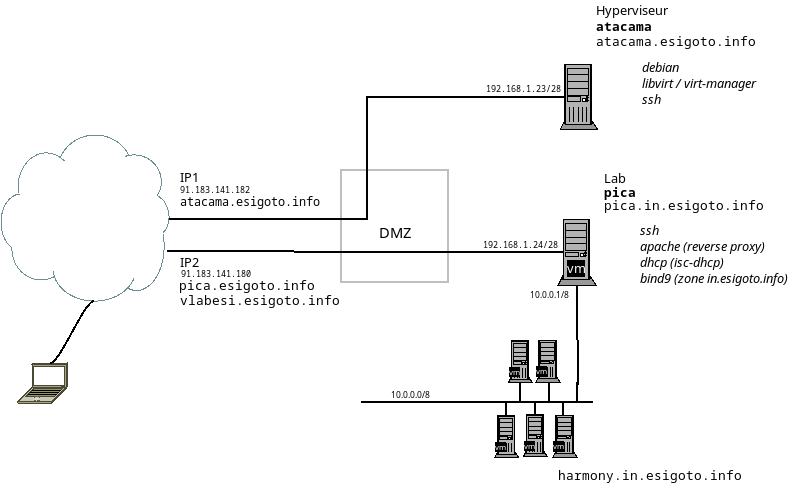

# Organisation 

_organisation des cours / labos_

[Fiche ECTS](https://ects.esi-bru.be/beta/cours/ac2526_5agr1i.html)

## Organisation du laboratoire virtuel

:::info
Un laboratoire virtuel, accessible en dehors de l'école, est disponible depuis 2020. Il permet de mettre à disposition une machine linux à chaque étudiant ou étudiante. 
:::

Le laboratoire virtuel est composé d'une machine physique, un _hyperviseur_ et de machines virtuelles. Le schéma du laboratoire est ci-dessous. 

L'accès au laboratoire virtuel se fait en `ssh` _via_ la machine _pica_. Les identifiants sont donnés au laboratoire. 

:::warning
La machine se trouve au sein de l'école : 
- l'accès à partir de **l'extérieur** de l'école se fait _via_ son IP publique. Cette IP publique est correctement donnée par les serveurs DNS;
- l'accès de **l'intérieur** de l'école doit se faire avec l'adresse IP privée de la machine. Les serveurs DNS ne donnent pas cette IP.
:::

:::tip
Utiliser son fichier `/etc/hosts` est une bonne idée. 
:::

Une fois connecté en `ssh` à la machine _pica_, il est possible de faire un saut sur la machine qui vous a été attribuée. Inutile de connaitre son IP privée, le serveur DNS interne la connait. 

## Planning

Planning informatif (peut-être sujet à des changements).
| Séance | Thème de la Séance      | Objectifs d'Apprentissage (modèle Bloom)                | Activité Pratique (Lab)      |
|--------|------------------------|------------------------------------------|------------------------------|
| 1  | Présentation  Rappels linux        | Se souvenir des commandes de base Linux. Comprendre l'environnement de travail. |—|
| 2  | Rappels réseaux      | Expliquer les concepts fondamentaux des réseaux.  Identifier les composants du laboratoire virtuel. |Découverte du laboratoire virtuel|
| 3  | SSH                  | Comprendre le protocole SSH.  Appliquer des notions de chiffrement.  Analyser la sécurité d'un serveur SSH. | **SSH**  Vérification de la configuration SSH.  Sécurisation du serveur.  Tentative de cracker un mot de passe. |
| 4      | DNS                    | Définir le rôle du DNS.  Installer et configurer un serveur DNS. | **DNS**  Installer un serveur DNS à cache seul.  Configurer une zone `in.example.org`.  Configurer un DNS menteur (_RPZ policy_)  |
| 5      | DNS / DNSSEC                   |  Mettre en œuvre la configuration avancée d'un serveur DNS.  Évaluer les politiques de sécurité DNS. | **DNS** (suite) |
| 6      | DHCP                  | Expliquer le fonctionnement du protocole DHCP.  Installer et configurer un serveur DHCP.  Analyser les baux (_leases_) DHCP et leur gestion. |**DHCP**  Installation d'un serveur DHCP.  Configuration de pools d'adresses.  Réservations d'adresses |
| 7      | PAM                  | Comprendre le rôle de PAM dans la gestion des accès.  Modifier et adapter la configuration PAM. | **PAM**  Modifier la configuration de certaines commandes.  Écrire un programme _pam enabled_.|
| 8      | HTTP(s)                  | Installer et configurer un serveur web.  Différencier les types de virtual hosts. Comprendre ce qu'est un _proxy_ et le mettre en œuvre. | **Apache2**  Installation d'un serveur avec _vhosts_.    |
| 9      | LDAP                   | Décrire l'utilité d'un annuaire LDAP.  Installer et utiliser un annuaire LDAP. | **LDAP**  Installation d'un annuaire LDAP (open LDAP).  Utilisation d'un annuaire avec un schéma existant |
| 10     | LDAP                   | Administrer et sécuriser un annuaire LDAP. | **LDAP** (suite)|
| 11     | LDAP             | Évaluer les usages avancés de LDAP.  | **LDAP** (suite) |
| 12     | _Récupération_,  réponse aux questions,   fin du travail                | Synthétiser les connaissances acquises.  |— |

## Pendant les manips

Pendant que vous faites vos _manips_ : 

1. complétez un document reprenant toutes vos manipulations.  Incluez :
    - Les contenus de vos fichiers de configuration
    - Vos démarches
    - Les problèmes rencontrés
    - Les solutions et moyens utilisés

2. consultez les pages de manuels (_si si, ça reste intéressant_)
    - commencez par un `man man` si vous ne savez pas ce qu'est une page de manuel
    